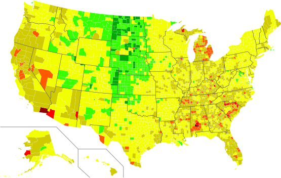
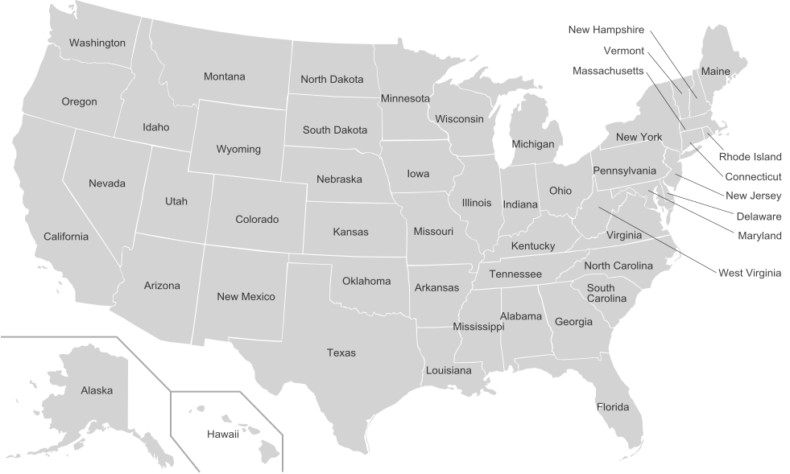
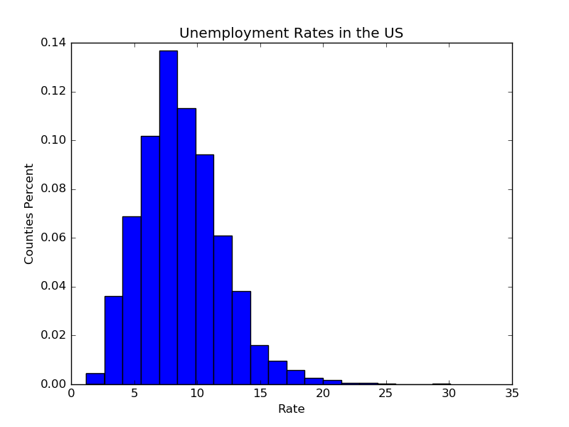

EX2: Data exploration from a CSV file
=====================================


In this exercise I've chosen to explore the unemployment rate in US counties.
I've found the data online and used python in order to generate maps/graphs from the CSV file.


Dependencies
------------
  1. CSV Library
  2. Beautiful Soup Library
  3. Matplotlib Library


Steps
-----
  * Read the data from the CSV file:
  
    ```python
    csv_reader = csv.reader(open('csv-source.csv'), delimiter=",")
    for row in csv_reader:
        id = row[1] + row[2]
        unemployment_rate = float(row[8].strip())
        unemployment_rate_list[id] = unemployment_rate
    ```

  * Define styles and map

  * Apply styles and generate map + graphs:
  
    ```python
    color_rate = get_rate(unemployment_rate)
    color = colors[color_rate]
    path['style'] = path_style + color
    data.append(unemployment_rate)
    target = open("final_map.svg", 'w')
    target.write(beautiful_soup.prettify())
    target.close()
    get_histogram(data)
    ```
  
  * Map and Graph functions:
  ```python
  if rate_to_check > 25:
        return 7
    elif rate_to_check > 20:
        return 6
    elif rate_to_check > 15:
        return 5
    elif rate_to_check > 10:
        return 4
    elif rate_to_check > 5:
        return 3
    elif rate_to_check > 3:
        return 2
    elif rate_to_check > 1:
        return 1
    else:
        return 0
  ```
  
  ```python
  plt.hist(data_to_use, bins=20, normed=True)
  plt.title("Unemployment Rates in the US")
  plt.xlabel("Rate")
  plt.ylabel("Counties Percent")
  plt.legend()
  plt.show()
  ```
  
Results
-------


Dark Green - Lowest rate (best result)

Yellow - Average

Dark Red - Highest rate (worst result)






* I've also considered adding a bar graph using Matplotlib's ```plt.bar()``` but the X ticks were to wide.


We can see that in most counties, the rate is about 7.5, which is pretty normal.
The problematic areas with a very high rate are mostly in the south of the US: southern California, Arizona, Alabama, and western Alaska.
The cause of the numbers in those places might be the Mexican immigrants and the 'Redneck' population of southern US.
What about Alaska? well we know that it's pretty cold there and I guess that the tough conditions might cause the high rate.

Our results are not very surprising because those areas are known for not beeing the best counties and states in the US.


What's next?
----------
We can check more thoroughly about the causes of the numbers we've got- what causes the high rate in the states we've mentioned,
and what causese the low rate in Dakota, Nebraska and Kansas. Also, what about New York, California? what causes the
surprisingly bad results?
In order to find these answers, we'll have to explore a bit further.

We can also check the average rate in the entire state, instead of exploring the counties, and maybe even check where the US
stants globally in relation to other countries.